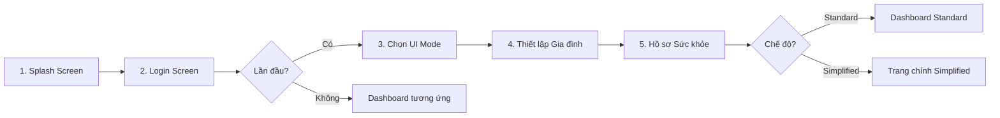
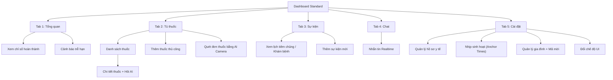
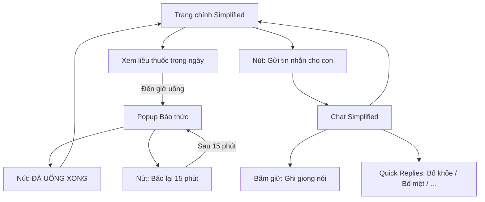
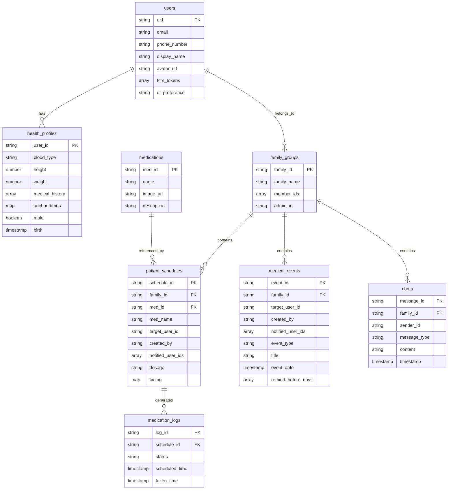
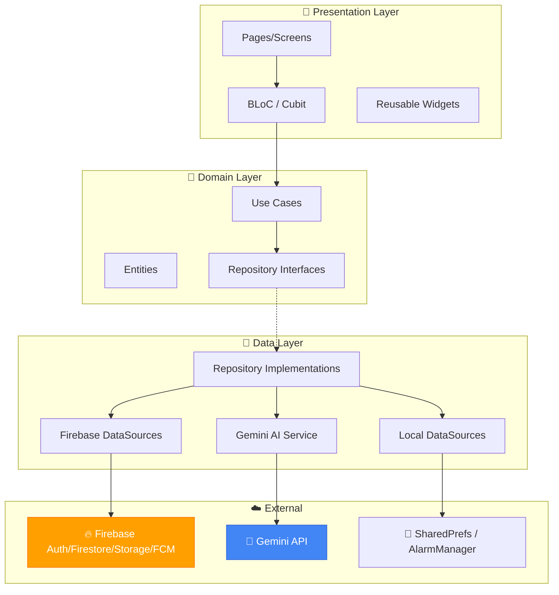

# 🏥 Basic Design — Ứng dụng Quản lý Y tế Gia đình

> **Nền tảng**: Flutter & Firebase
> **Phong cách tham chiếu**: [Mobile Apps – Prototyping Kit (Figma Community)](https://www.figma.com/design/xBntRTPki6MSnvnjmW7OwD)
> **Tài liệu gốc**: SRS, UML & Database Design, UI/UX Design Document

---

## 1. Hệ thống Thiết kế (Design System)

### 1.1 Bảng màu (Color Palette)

| Token                 | Hex       | Sử dụng                                           |
|-----------------------|-----------|----------------------------------------------------|
| `primary`             | `#0066FF` | Nút chính, icon active, link, tiêu đề nhấn mạnh   |
| `primary-light`       | `#E8F0FE` | Nền tag, badge, nền nút phụ                        |
| `secondary`           | `#00BFA5` | Accent tông xanh y tế, trạng thái "Hoàn thành"     |
| `background`          | `#FFFFFF` | Nền chính toàn bộ screens                          |
| `surface`             | `#F5F5F5` | Nền card, input field, section phụ                  |
| `text-primary`        | `#1A1A1A` | Tiêu đề, heading                                   |
| `text-secondary`      | `#666666` | Body text, hint text, mô tả                        |
| `success`             | `#4CAF50` | Trạng thái "Đã uống", xác nhận thành công           |
| `warning`             | `#FF9800` | Trạng thái "Báo lại / Snooze"                      |
| `error`               | `#F44336` | Trạng thái "Bỏ lỡ", cảnh báo trễ hạn              |
| `simplified-bg`       | `#1A1A2E` | Nền tối cho chế độ Simplified Mode (Người cao tuổi)|
| `simplified-text`     | `#FFFFFF` | Chữ trắng trên nền tối (Simplified Mode)           |

### 1.2 Typography

| Cấp bậc             | Standard Mode        | Simplified Mode       |
|----------------------|----------------------|-----------------------|
| **Heading 1**        | 24sp / Bold          | 32sp / Bold           |
| **Heading 2**        | 20sp / SemiBold      | 28sp / SemiBold       |
| **Body**             | 16sp / Regular       | 22sp / Regular        |
| **Caption**          | 14sp / Regular       | 18sp / Regular        |
| **Button**           | 16sp / SemiBold      | 22sp / Bold           |

> **Font family**: `Inter` (Google Fonts) — sạch sẽ, dễ đọc, hỗ trợ tiếng Việt tốt.

### 1.3 Component Tokens

| Component         | Thuộc tính                                                  |
|--------------------|--------------------------------------------------------------|
| **Button Primary** | Height 48dp, border-radius 24dp (capsule), bg `primary`, text white |
| **Button Secondary** | Height 48dp, border-radius 24dp, bg `primary-light`, text `primary` |
| **Button Simplified** | Height **72dp**, full-width, border-radius 16dp, chữ 22sp Bold |
| **Card**           | bg `white`, border-radius 16dp, shadow `0 2px 8px rgba(0,0,0,.06)` |
| **Input Field**    | Height 52dp, border-radius 12dp, bg `surface`, no border    |
| **Avatar**         | Hình tròn, border 2dp `primary-light`                      |
| **Bottom Nav**     | 5 tabs, icon outline 24dp + label 12sp, active = `primary` |
| **FAB**            | 56dp, border-radius 28dp (circle), bg `primary`            |

### 1.4 Spacing & Grid

| Token   | Giá trị |
|---------|---------|
| `xs`    | 4dp     |
| `sm`    | 8dp     |
| `md`    | 16dp    |
| `lg`    | 24dp    |
| `xl`    | 32dp    |
| `xxl`   | 48dp    |

> Padding nội dung screen: horizontal `md` (16dp), vertical `lg` (24dp).

### 1.5 Iconography

- Style: **Outline / Line-art** nhất quán (Material Symbols Outlined hoặc Fluent Icons).
- Kích thước chuẩn: 24dp (Standard), 32dp (Simplified).
- Màu: `text-secondary` khi inactive, `primary` khi active.

---

## 2. Luồng di chuyển (User Flow)

Hệ thống được chia thành **3 luồng chính**:

### 2.A Luồng Nhập môn (Onboarding Flow)

Dành cho người dùng mới đăng nhập lần đầu để thiết lập hệ sinh thái gia đình.

1. **Splash Screen** (Khởi động)
2. **Login Screen** (Đăng nhập Google)
3. **Chọn chế độ UI** (Standard hoặc Simplified)
4. **Thiết lập Gia đình** (Tạo nhóm hoặc Nhập mã tham gia)
5. **Thiết lập Hồ sơ Sức khỏe** (Nhóm máu, cân nặng, tiền sử bệnh)
6. 👉 Chuyển đến **Dashboard** tương ứng.



---

### 2.B Luồng Người chăm sóc (Standard Mode Flow)

Giao diện đầy đủ tính năng, quản lý thông qua **5 Tab chính**:

1. **Tab 1: Tổng quan (Home)** → Xem chỉ số hoàn thành, nhận Cảnh báo trễ hạn.
2. **Tab 2: Tủ thuốc** → Danh sách thuốc → Chi tiết thuốc & Hỏi AI / Thêm thuốc (AI Camera).
3. **Tab 3: Sự kiện** → Xem lịch tiêm chủng/khám → Thêm Sự kiện mới.
4. **Tab 4: Chat** → Nhắn tin realtime với các thành viên.
5. **Tab 5: Cài đặt** → Quản lý hồ sơ, mã mời, đổi chế độ UI.



---

### 2.C Luồng Người cao tuổi (Simplified Mode Flow)

Tối giản hóa tối đa để người già dễ sử dụng (**Single Page App**).

1. **Trang chính Simplified** — Xem các liều thuốc trong ngày.
2. **Báo thức uống thuốc (Popup)** → Xác nhận "Đã uống" hoặc "Báo lại".
3. **Chat Simplified** — Trả lời bằng giọng nói hoặc nút bấm nhanh.



---

## 3. Chi tiết từng Màn hình

### 3.1 Splash Screen

#### Tổng quan bố cục
Màn hình giới thiệu hiển thị khi mở ứng dụng, mục đích tạo ấn tượng thương hiệu và chờ khởi tạo Firebase/dịch vụ nền. Toàn bộ nội dung được **căn giữa theo cả chiều ngang và chiều dọc** (Center alignment) trên nền gradient.

#### Cấu trúc phân vùng (1 vùng duy nhất — Center Stack)

| Thành phần | Mô tả chi tiết |
|---|---|
| **Nền toàn màn hình** | Gradient tuyến tính từ trên xuống dưới: `primary` (#0066FF) → `primary-light` (#E8F0FE). Tạo cảm giác sạch sẽ, chuyên nghiệp y tế. |
| **Logo ứng dụng** | Biểu tượng hình trái tim lồng chữ thập y tế, kích thước **80x80dp**, đặt ở trung tâm màn hình. Logo có hiệu ứng **fade-in + scale** nhẹ (duration 600ms) khi xuất hiện. |
| **Tên ứng dụng chính** | Text "**Family Health**", font Inter 28sp Bold, màu `white`, cách logo `lg` (24dp) phía dưới, căn giữa. |
| **Tên phụ** | Text "Quản lý Y tế Gia đình", font Inter 16sp Regular, màu `white` opacity 80%, cách tên chính `sm` (8dp) phía dưới. |
| **Loading indicator** | Một `CircularProgressIndicator` nhỏ (24dp), màu `white`, cách tên phụ `xl` (32dp) phía dưới. Quay liên tục trong suốt thời gian splash. |

#### Hành vi & Chuyển tiếp
- Hiển thị tối thiểu **2 giây**, đồng thời chờ Firebase khởi tạo xong.
- Khi sẵn sàng, chuyển sang Login Screen bằng hiệu ứng **fade-out toàn màn hình** (duration 300ms).
- Nếu người dùng đã đăng nhập trước đó → bỏ qua Login, chuyển thẳng vào Dashboard.

```
┌─────────────────────────────────────────┐
│         [Gradient primary → light]      │
│                                         │
│              (khoảng trắng)             │
│                                         │
│           ┌───────────────┐             │
│           │  🏥 App Logo  │             │
│           │    80x80dp    │             │
│           └───────────────┘             │
│                                         │
│        Family Health Manager            │
│      Quản lý Y tế Gia đình             │
│                                         │
│           ● ● ● (loading)              │
│                                         │
└─────────────────────────────────────────┘
```

---

### 3.2 Login Screen

#### Tổng quan bố cục
Màn hình đăng nhập có bố cục **Column dọc, căn giữa ngang**, chia thành 3 vùng rõ rệt từ trên xuống. Nền toàn bộ màu `background` (#FFFFFF). Mục tiêu: tối giản, chỉ 1 hành động duy nhất — bấm nút đăng nhập Google.

#### Cấu trúc phân vùng

**Vùng 1 — Illustration (Top, chiếm ~40% chiều cao màn hình)**
- Một hình minh họa vector art phong cách **flat design**, tông màu xanh y tế `primary` + `secondary`.
- Nội dung hình: Gia đình (bố, mẹ, con) đứng cạnh biểu tượng trái tim/chữ thập.
- Kích thước: rộng **280dp**, cao **220dp**, căn giữa ngang, cách top `xxl` (48dp).

**Vùng 2 — Welcome Text (Middle)**
- **Tiêu đề chính**: "Chào mừng đến Family Health", font Inter 24sp Bold, màu `text-primary` (#1A1A1A), căn giữa, cách illustration `lg` (24dp) phía dưới.
- **Mô tả phụ**: "Quản lý sức khỏe cả nhà, mọi lúc mọi nơi", font Inter 16sp Regular, màu `text-secondary` (#666666), căn giữa, cách tiêu đề `sm` (8dp).

**Vùng 3 — Action (Bottom, cố định gần đáy)**
- **Nút đăng nhập Google**: Capsule button (border-radius 24dp), chiều cao 52dp, chiều rộng full-width trừ padding (margin horizontal `md` 16dp). Nền `white`, viền 1dp `#DADCE0`. Bên trong chứa: icon Google (20dp) bên trái + text "Đăng nhập bằng Google" (16sp SemiBold, màu `#1A1A1A`), canh giữa theo hàng ngang (Row, center). Khi bấm có hiệu ứng ripple nhẹ.
- **Disclaimer text**: "Bằng việc tiếp tục, bạn đồng ý với Điều khoản sử dụng", font Inter 12sp Regular, màu `text-secondary`, căn giữa, cách nút `md` (16dp) phía dưới. Cụm "Điều khoản sử dụng" là **hyperlink** màu `primary`.

#### Hành vi
- Bấm nút → Gọi Firebase Auth / Google Sign-in SDK.
- Nếu đăng nhập lần đầu → chuyển sang màn hình Chọn UI Mode (3.3).
- Nếu đã có tài khoản → chuyển thẳng vào Dashboard.
- Khi đang xử lý: nút đổi thành trạng thái loading (CircularProgressIndicator thay text).

```
┌─────────────────────────────────────────┐
│                                         │
│           ┌───────────────┐             │
│           │  Illustration │  Vùng 1     │
│           │  280x220dp    │  ~40%       │
│           │  (flat vector)│             │
│           └───────────────┘             │
│                                         │
│   Chào mừng đến Family Health  Vùng 2  │
│   Quản lý sức khỏe cả nhà              │
│                                         │
│   ┌─────────────────────────────────┐   │
│   │  G  Đăng nhập bằng Google      │   │
│   │   (52dp, capsule, white+border) │   │
│   └─────────────────────────────────┘   │
│                                  Vùng 3 │
│   Bằng việc tiếp tục, bạn đồng ý      │
│   với Điều khoản sử dụng              │
│                                         │
└─────────────────────────────────────────┘
```

---

### 3.3 Chọn UI Mode (Lần đầu đăng nhập)

#### Tổng quan bố cục
Màn hình xuất hiện **chỉ 1 lần duy nhất** sau khi đăng nhập lần đầu. Bố cục **Column dọc**, nền `background` (#FFFFFF). Mục tiêu: để người dùng chọn giữa 2 chế độ giao diện phù hợp với khả năng sử dụng công nghệ của mình.

#### Cấu trúc phân vùng

**Vùng 1 — Header (Top)**
- **Tiêu đề**: "Chọn chế độ giao diện", font Inter 24sp Bold, màu `text-primary`, căn giữa, padding top `xl` (32dp).
- **Mô tả phụ**: "Bạn có thể thay đổi sau trong phần Cài đặt", font Inter 14sp Regular, màu `text-secondary`, căn giữa, cách tiêu đề `sm` (8dp).

**Vùng 2 — Selection Cards (Middle, chiếm phần lớn màn hình)**

Gồm **2 Card lựa chọn** xếp dọc, cách nhau `md` (16dp), margin horizontal `md` (16dp):

- **Card 1 — Standard Mode**:
  - Kích thước: full-width, chiều cao ~180dp, border-radius 16dp, nền `white`, shadow `0 2px 8px rgba(0,0,0,.06)`.
  - Góc trên trái: Emoji 📱 (24dp) + text "**Standard Mode**" (20sp SemiBold, `text-primary`), xếp ngang (Row).
  - Dòng mô tả: "Đầy đủ tính năng, dành cho người chăm sóc", font 14sp, màu `text-secondary`.
  - Bên phải card: Ảnh minh họa thu nhỏ (~120x90dp) cho thấy preview Dashboard.
  - Khi được chọn: viền 2dp `primary`, nền chuyển sang `primary-light` (#E8F0FE), có dấu ✓ tròn xanh ở góc phải trên.

- **Card 2 — Simplified Mode**:
  - Cấu trúc tương tự Card 1 nhưng icon là 👴, tiêu đề "**Simplified Mode**".
  - Mô tả: "Giao diện đơn giản, chữ to, dành cho người cao tuổi".
  - Ảnh minh họa: preview giao diện chữ to, nút lớn.
  - Trạng thái chưa chọn: viền 1dp `#E0E0E0`, nền `white`.

**Vùng 3 — Action Button (Bottom)**
- **Nút "Tiếp tục →"**: Button Primary capsule (48dp, full-width trừ padding, bg `primary`, text white 16sp SemiBold). Nằm cố định gần đáy, cách Card cuối `lg` (24dp). Chỉ hoạt động (enabled) khi đã chọn 1 trong 2 card.

```
┌─────────────────────────────────────────┐
│         Chọn chế độ giao diện           │
│    Bạn có thể thay đổi sau              │
│                                         │
│  ┌────────────────────────────────────┐ │
│  │  📱 Standard Mode     [Preview]   │ │
│  │  Đầy đủ tính năng dành cho       │ │
│  │  người chăm sóc        ✓ selected │ │
│  └────────────────────────────────────┘ │
│                                         │
│  ┌────────────────────────────────────┐ │
│  │  👴 Simplified Mode   [Preview]   │ │
│  │  Giao diện đơn giản, chữ to      │ │
│  │  dành cho người cao tuổi          │ │
│  └────────────────────────────────────┘ │
│                                         │
│  ┌─────────────────────────────────┐    │
│  │        Tiếp tục →               │    │
│  └─────────────────────────────────┘    │
└─────────────────────────────────────────┘
```

---

### 3.4 Tạo / Nhập mã Gia đình

#### Tổng quan bố cục
Màn hình onboarding bước cuối trước khi vào Dashboard. Bố cục **Column dọc**, nền `background`. Người dùng chọn 1 trong 2 luồng: tạo nhóm mới (trở thành Admin) hoặc tham gia nhóm đã có bằng mã mời.

#### Cấu trúc phân vùng

**Vùng 1 — AppBar (Top)**
- Nút back ← (icon arrow_back, 24dp, màu `text-primary`) ở góc trái.
- Tiêu đề: "Thiết lập Gia đình", font Inter 20sp SemiBold, `text-primary`, căn giữa.

**Vùng 2 — Option 1: Tạo nhóm mới**
- Card full-width, border-radius 16dp, nền `white`, shadow nhẹ, padding `md` (16dp), margin horizontal `md`.
- Hàng trên (Row): Emoji 👨‍👩‍👧‍👦 (32dp) + Text "**Tạo nhóm gia đình mới**" (18sp SemiBold).
- Dòng dưới: "Bạn sẽ là Quản trị viên của nhóm", font 14sp, `text-secondary`.
- Khi bấm vào card → mở form nhập tên nhóm gia đình (Input field bên trong card, xuất hiện bằng animation slide-down).

**Vùng 3 — Divider**
- Một dòng phân cách ngang với text "hoặc" ở giữa. Hai bên là đường kẻ 1dp `#E0E0E0`. Text "hoặc" font 14sp, `text-secondary`.

**Vùng 4 — Option 2: Nhập mã mời**
- Card full-width, cấu trúc tương tự Option 1.
- Emoji 🔗 + Text "**Tham gia gia đình có sẵn**" (18sp SemiBold).
- Bên trong card: Input field (border-radius 12dp, bg `surface`, height 52dp), placeholder: "Nhập mã 6 ký tự...", font 16sp. Bàn phím hiện kiểu chữ/số.

**Vùng 5 — Action Button (Bottom)**
- Nút "Tiếp tục →": Button Primary, tương tự 3.3.

```
┌─────────────────────────────────────────┐
│  ←  Thiết lập Gia đình                 │
│                                         │
│  ┌─────────────────────────────────┐    │
│  │  👨‍👩‍👧‍👦  Tạo nhóm gia đình mới    │    │
│  │  Bạn sẽ là Quản trị viên       │    │
│  └─────────────────────────────────┘    │
│                                         │
│  ────────── hoặc ──────────             │
│                                         │
│  ┌─────────────────────────────────┐    │
│  │  🔗  Tham gia gia đình có sẵn   │    │
│  │  ┌─────────────────────────┐    │    │
│  │  │  Nhập mã 6 ký tự...    │    │    │
│  │  └─────────────────────────┘    │    │
│  └─────────────────────────────────┘    │
│                                         │
│  ┌─────────────────────────────────┐    │
│  │        Tiếp tục →               │    │
│  └─────────────────────────────────┘    │
└─────────────────────────────────────────┘
```

---

### 3.5 Dashboard — Standard Mode (Tab 1: Tổng quan)

#### Tổng quan bố cục
Đây là màn hình chính sau khi đăng nhập, nơi Caregiver theo dõi tình hình uống thuốc của **toàn bộ thành viên gia đình** trong ngày. Bố cục **ScrollView dọc** (cuộn được), nền `background` (#FFFFFF). Phần dưới cùng cố định là **Bottom Navigation Bar** 5 tab.

#### Cấu trúc phân vùng

**Vùng 1 — Greeting Header (Top, không cuộn)**
- Nền `background`, padding horizontal `md` (16dp), padding top `lg` (24dp).
- Hàng 1 (Row): Text "**Xin chào, [display_name]** 👋", font Inter 24sp Bold, `text-primary`, căn trái. Bên phải: Avatar tròn 40dp (lấy từ `avatar_url`), có border 2dp `primary-light`.
- Hàng 2: Text "Hôm nay [dd/MM/yyyy]", font Inter 14sp Regular, `text-secondary`, cách Hàng 1 khoảng `xs` (4dp).

**Vùng 2 — Summary Card (Scrollable content)**
- Card nền `white`, border-radius 16dp, shadow `0 2px 8px rgba(0,0,0,.06)`, margin horizontal `md`, margin top `md`.
- **Header card**: Text "📊 Tổng quan gia đình hôm nay", font 16sp SemiBold, `text-primary`.
- **Thân card** (Column):
  - 3 dòng trạng thái xếp dọc, mỗi dòng gồm: icon trạng thái (✅/⏳/❌) + text mô tả + số liệu. Font 14sp Regular.
    - ✅ "Đã uống: X/Y liều" — icon màu `success` (#4CAF50)
    - ⏳ "Đang chờ: N liều" — icon màu `warning` (#FF9800)
    - ❌ "Bỏ lỡ: N liều" — icon màu `error` (#F44336)
  - **Progress bar**: Chiều cao 8dp, border-radius 4dp, nền `surface`. Phần đã hoàn thành: gradient `secondary` → `success`. Hiển thị phần trăm (%) bên phải bar, font 14sp Bold.

**Vùng 3 — Alert Section**
- Tiêu đề section: "⚠️ Cảnh báo", font 18sp SemiBold, `text-primary`, margin top `lg`.
- **Alert Card** (hiển thị khi có liều trễ hạn):
  - Card nền `#FFF3F0` (đỏ rất nhạt), border-left 4dp `error` (#F44336), border-radius 12dp.
  - Nội dung (Column): 
    - Dòng 1: "🔴 [Tên thành viên] vẫn chưa xác nhận uống thuốc [Tên thuốc]", font 14sp SemiBold, `text-primary`.
    - Dòng 2: "Trễ [X] phút", font 14sp Regular, `error`.
    - Hàng nút (Row, căn phải): Button Secondary "Nhắc lại" + Button text "Xem" (màu `primary`).
  - Nếu có nhiều cảnh báo: xếp dọc, cách nhau `sm` (8dp).
  - Nếu không có cảnh báo: ẩn toàn bộ Vùng 3.

**Vùng 4 — Member Overview**
- Tiêu đề: "👨‍👩‍👧 Thành viên", font 18sp SemiBold, margin top `lg`.
- Một **ListView cuộn ngang** chứa các Member Chip:
  - Mỗi chip: Column gồm Avatar tròn 48dp (trên) + Tên (font 12sp, dưới avatar) + Ratio "X/Y" (font 12sp Bold, dưới tên).
  - Chip cách nhau `md` (16dp).
  - Nếu ratio đạt 100%: viền avatar màu `success`. Nếu có liều trễ: viền `error`.
  - Bấm vào chip → lọc Dashboard chỉ hiển thị thông tin của thành viên đó.

**Vùng 5 — Bottom Navigation Bar (Cố định đáy)**
- Nền `white`, shadow top `0 -1px 4px rgba(0,0,0,.06)`, chiều cao 56dp.
- 5 tab xếp ngang đều: 🏠 Home | 💊 Thuốc | 📅 Sự kiện | 💬 Chat | ⚙️ Cài đặt.
- Mỗi tab: icon outline 24dp (trên) + label 12sp (dưới). Tab active: icon filled + label màu `primary`. Tab inactive: icon outline + label `text-secondary`.

```
┌─────────────────────────────────────────┐
│  Xin chào, Trung Hòa 👋      [Avatar]  │  ← Vùng 1
│  Hôm nay 26/03/2026                     │
│                                         │
│  ┌─────────────────────────────────┐    │
│  │ 📊 Tổng quan gia đình hôm nay  │    │  ← Vùng 2
│  │  ✅ Đã uống: 4/6 liều          │    │
│  │  ⏳ Đang chờ: 1 liều           │    │
│  │  ❌ Bỏ lỡ: 1 liều             │    │
│  │  [████████░░] 67%              │    │
│  └─────────────────────────────────┘    │
│                                         │
│  ⚠️ Cảnh báo                           │  ← Vùng 3
│  ┌─────────────────────────────────┐    │
│  │ 🔴 Bố chưa xác nhận Huyết Áp   │    │
│  │    Trễ 23 phút  [Nhắc lại][Xem]│    │
│  └─────────────────────────────────┘    │
│                                         │
│  👨‍👩‍👧 Thành viên                           │  ← Vùng 4
│  ┌──────┐  ┌──────┐  ┌──────┐          │
│  │Avatar│  │Avatar│  │Avatar│  → scroll │
│  │ Bố   │  │ Mẹ   │  │  Em  │          │
│  │ 4/6  │  │ 2/2  │  │ 0/0  │          │
│  └──────┘  └──────┘  └──────┘          │
│ ━━━━━━━━━━━━━━━━━━━━━━━━━━━━━━━━━━━━━━ │  ← Vùng 5
│ 🏠   💊   📅   💬   ⚙️                  │
│ Home  Thuốc Sự kiện Chat  Cài đặt      │
└─────────────────────────────────────────┘
```

---

### 3.6 Dashboard — Tab 2: Tủ thuốc

#### Tổng quan bố cục
Màn hình quản lý danh sách tất cả các đơn thuốc của gia đình. Bố cục **ScrollView dọc**, nền `background`. Có bộ lọc theo thành viên ở trên cùng. Nút FAB (Floating Action Button) ở góc dưới phải để thêm thuốc mới.

#### Cấu trúc phân vùng

**Vùng 1 — AppBar (Top)**
- Nền `background`, chiều cao 56dp.
- Bên trái: icon back ← (chỉ hiển thị khi vào từ deep link, ẩn khi ở tab chính).
- Giữa: Text "Tủ thuốc", font Inter 20sp SemiBold, `text-primary`.
- Bên phải: icon search 🔍 (24dp, `text-secondary`). Khi bấm → mở SearchBar dạng overlay, cho phép tìm theo tên thuốc.

**Vùng 2 — Member Filter Chips (Dưới AppBar)**
- Một **ListView cuộn ngang** chứa các Chip lọc theo thành viên.
- Mỗi Chip: border-radius 20dp (capsule), chiều cao 36dp, padding horizontal `md`. Nội dung: tên thành viên (font 14sp SemiBold).
- **Chip active**: bg `primary` (#0066FF), text `white`. **Chip inactive**: bg `surface` (#F5F5F5), text `text-secondary`.
- Chip đặc biệt "Tất cả" luôn ở đầu danh sách.
- Khi chọn chip → lọc danh sách thuốc bên dưới chỉ hiển thị thuốc của thành viên đó.

**Vùng 3 — Medication List (Scrollable, chiếm phần lớn)**
- Danh sách các **Medication Card** xếp dọc, cách nhau `sm` (8dp), margin horizontal `md`.
- **Cấu trúc mỗi Medication Card**:
  - Card nền `white`, border-radius 16dp, shadow nhẹ, padding `md`, chiều cao ~100dp.
  - Bố cục bên trong: **Row** (ngang).
    - **Bên trái**: Ảnh thuốc (56x56dp, border-radius 8dp, bg `surface` nếu không có ảnh). Lấy từ `medications.image_url`.
    - **Bên phải** (Column, flex 1):
      - Dòng 1: "💊 **[Tên thuốc] [Liều lượng]**", font 16sp SemiBold, `text-primary`.
      - Dòng 2: Mô tả ngắn (VD: "Huyết áp"), font 14sp Regular, `text-secondary`.
      - Dòng 3 (Row): "📅 [Lịch trình]" + " | " + "[Liều/lần]", font 13sp, `text-secondary`.
      - Dòng 4 (Row): "👤 [Tên người uống]" căn trái + nút "Chi tiết →" màu `primary` căn phải.
  - Khi bấm vào card → chuyển sang màn hình Chi tiết thuốc (3.8).
  - Có thể **swipe trái** để hiện nút Xóa (bg `error`, icon trash).

**Vùng 4 — FAB (Floating Action Button)**
- Hình tròn 56dp, bg `primary`, icon ➕ màu `white`, vị trí cố định: góc dưới phải, cách bottom `xxl` (48dp — trên Bottom Nav), cách right `md`.
- Shadow: `0 4px 12px rgba(0,102,255,.3)`.
- Khi bấm → hiện **Bottom Sheet** dạng modal trượt lên, chứa 2 option:
  - Option 1: "📝 Thêm thuốc thủ công" (icon + text, font 16sp).
  - Option 2: "📸 Quét đơn thuốc bằng AI" (icon + text, font 16sp, highlight `primary`).

**Vùng 5 — Bottom Navigation Bar**: Giống mô tả ở 3.5, tab "Thuốc" đang active.

```
┌─────────────────────────────────────────┐
│  ←  Tủ thuốc                       🔍  │  ← Vùng 1
│                                         │
│  [Tất cả] [Bố ▾] [Mẹ] [Em]  → scroll  │  ← Vùng 2
│                                         │
│  ┌─────────────────────────────────┐    │
│  │ [Ảnh]  💊 Losartan 50mg        │    │  ← Vùng 3
│  │ 56x56  Huyết áp                │    │
│  │        📅 Sáng & Tối | 1 viên  │    │
│  │        👤 Bố     [Chi tiết →]  │    │
│  └─────────────────────────────────┘    │
│  ┌─────────────────────────────────┐    │
│  │ [Ảnh]  💊 Metformin 500mg      │    │
│  │ 56x56  Tiểu đường             │    │
│  │        📅 Sau ăn sáng | 1 viên │    │
│  │        👤 Bố     [Chi tiết →]  │    │
│  └─────────────────────────────────┘    │
│                                         │
│                                  (＋)   │  ← Vùng 4 FAB
│ ━━━━━━━━━━━━━━━━━━━━━━━━━━━━━━━━━━━━━━ │  ← Vùng 5
│ 🏠   💊   📅   💬   ⚙️                  │
└─────────────────────────────────────────┘
```

---

### 3.7 Thêm Thuốc bằng AI Camera

#### Tổng quan bố cục
Đây là màn hình "điểm nhấn công nghệ" của ứng dụng. Bố cục **ScrollView dọc**, nền `background`. Chia thành 4 khu vực chính: nút quét AI, form thông tin thuốc, cấu hình lịch trình, và nút lưu. Toàn bộ form hỗ trợ 2 chế độ: nhập thủ công và AI tự điền.

#### Cấu trúc phân vùng

**Vùng 1 — AppBar**
- Nút back ← bên trái, tiêu đề "Thêm đơn thuốc" (20sp SemiBold) căn giữa.

**Vùng 2 — AI Scanner Card (Khu vực nổi bật nhất)**
- Card nền `primary-light` (#E8F0FE), border **dashed** 2dp màu `primary`, border-radius 16dp, padding `lg` (24dp), margin horizontal `md`.
- Bên trong căn giữa (Column, center):
  - Icon camera 📸 kích thước 40dp, màu `primary`.
  - Text "**Quét Đơn Thuốc bằng AI**", font 18sp SemiBold, `primary`, cách icon `sm`.
  - Text "Chụp ảnh đơn thuốc để AI tự động nhận diện", font 14sp Regular, `text-secondary`, cách dòng trên `xs`.
- Khi bấm → mở Camera native. Sau khi chụp → hiện preview ảnh + nút "Sử dụng ảnh này" / "Chụp lại".
- Trong lúc AI xử lý: card đổi thành trạng thái loading (shimmer effect trên toàn card + text "Đang phân tích...").

**Vùng 3 — Form Thông tin thuốc (Section có tiêu đề)**
- Section header: dòng kẻ ngang mỏng 1dp `#E0E0E0` với text "Thông tin thuốc" ở giữa (divider with label), font 14sp SemiBold, `text-secondary`, margin top `lg`.
- Các trường input xếp dọc, cách nhau `md` (16dp):

  - **Trường "Tên thuốc" (bắt buộc)**:
    - Label: "Tên thuốc *", font 14sp Regular, `text-secondary`.
    - Input: height 52dp, border-radius 12dp, bg `surface`, font 16sp, placeholder "VD: Losartan".
    - Khi AI tự điền: nền input đổi sang `#FFF8E1` (vàng nhạt) + badge nhỏ "✨ AI" (chip 20dp, bg `secondary`, text white, font 10sp Bold) hiện ở góc phải trên input.

  - **Trường "Liều lượng" (bắt buộc)**:
    - Cấu trúc tương tự trên. Placeholder: "VD: 50mg - 1 viên".
    - Cũng có badge "✨ AI" khi được điền tự động.

- **Validation**: Real-time. Nếu trường trống khi bấm Lưu → viền input đổi sang `error` + text lỗi nhỏ bên dưới ("Vui lòng nhập tên thuốc"), font 12sp, `error`.

**Vùng 4 — Form Lịch trình (Section có tiêu đề)**
- Section header: divider with label "Lịch trình", tương tự Vùng 3.
- Bố cục **2 cột x 2 hàng** (Grid 2 columns), gap `md`:
  - **Ô 1** — "Người uống": Dropdown (height 52dp, border-radius 12dp, bg `surface`). Hiển thị tên thành viên gia đình. Icon ▾ bên phải.
  - **Ô 2** — "Mốc thời gian": Dropdown với các option từ `anchor_times`: "Giờ ăn sáng", "Giờ ăn trưa", "Giờ ăn tối", "Giờ đi ngủ", hoặc "Giờ cố định" (cho phép chọn giờ tuyệt đối).
  - **Ô 3** — "Độ lệch": Dropdown: "Trước 30p", "Ngay lúc ăn", "Sau 30p", "Sau 1h". (Chỉ hiện khi chọn mốc tương đối ở Ô 2).
  - **Ô 4** — "Người giám sát": Multi-select dropdown. Cho phép chọn nhiều thành viên. Hiển thị dạng chip khi đã chọn.

**Vùng 5 — Nút Lưu (Bottom)**
- Button Primary full-width (capsule 48dp, bg `primary`, text "💾 Lưu đơn thuốc" 16sp SemiBold white), margin horizontal `md`, margin top `lg`.
- Khi bấm: validate → nếu OK → lưu vào Firestore (`patient_schedules` + `medications`) → hiện SnackBar thành công màu `success` → quay về Tủ thuốc.

```
┌─────────────────────────────────────────┐
│  ←  Thêm đơn thuốc                     │  ← Vùng 1
│                                         │
│  ┌╌╌╌╌╌╌╌╌╌╌╌╌╌╌╌╌╌╌╌╌╌╌╌╌╌╌╌╌╌╌╌┐    │
│  │   📸 Quét Đơn Thuốc bằng AI   │    │  ← Vùng 2
│  │   (dashed border, bg light)    │    │
│  └╌╌╌╌╌╌╌╌╌╌╌╌╌╌╌╌╌╌╌╌╌╌╌╌╌╌╌╌╌╌╌┘    │
│                                         │
│  ── Thông tin thuốc ────────────────    │  ← Vùng 3
│  Tên thuốc *              ✨ AI filled  │
│  ┌─────────────────────────────────┐    │
│  │  Losartan          (bg #FFF8E1) │    │
│  └─────────────────────────────────┘    │
│  Liều lượng *             ✨ AI filled  │
│  ┌─────────────────────────────────┐    │
│  │  50mg - 1 viên                  │    │
│  └─────────────────────────────────┘    │
│                                         │
│  ── Lịch trình ────────────────────     │  ← Vùng 4
│  ┌──────────┐  ┌─────────────┐         │
│  │ Bố    ▾  │  │ Sau ăn sáng▾│         │
│  └──────────┘  └─────────────┘         │
│  ┌──────────┐  ┌─────────────┐         │
│  │ Sau 30p ▾│  │ Trung Hòa ▾ │         │
│  └──────────┘  └─────────────┘         │
│                                         │
│  ┌─────────────────────────────────┐    │  ← Vùng 5
│  │        💾  Lưu đơn thuốc       │    │
│  └─────────────────────────────────┘    │
└─────────────────────────────────────────┘
```

---

### 3.8 Chi tiết Thuốc + Hỏi AI

#### Tổng quan bố cục
Màn hình hiển thị toàn bộ thông tin của một đơn thuốc cụ thể, bao gồm chức năng **hỏi Trợ lý AI** về thuốc. Bố cục **ScrollView dọc**, nền `background`. Có các nút hành động (Sửa, Copy, Xóa) ở phần cuối.

#### Cấu trúc phân vùng

**Vùng 1 — AppBar**
- Nút back ←, tiêu đề "Chi tiết thuốc" (20sp SemiBold).

**Vùng 2 — Hero Section (Ảnh + Tên thuốc)**
- Ảnh thuốc lớn **80x80dp**, border-radius 12dp, bg `surface` (nếu không có ảnh thì hiện icon 💊 placeholder), căn giữa ngang, cách AppBar `lg` (24dp).
- Text tên thuốc: "**Losartan 50mg**", font 22sp Bold, `text-primary`, căn giữa, cách ảnh `md`.
- Text mô tả ngắn: "Thuốc điều trị tăng huyết áp" (lấy từ `medications.description`), font 14sp Regular, `text-secondary`, căn giữa.

**Vùng 3 — Info List (Thông tin chi tiết)**
- Danh sách các Row thông tin, mỗi row cách nhau `sm` (8dp), margin horizontal `md`, margin top `lg`:
  - "📋 **Liều lượng**: [dosage]" — font 15sp, `text-primary`.
  - "⏰ **Giờ uống**: [timing description]" — font 15sp.
  - "👤 **Người uống**: [target_user display_name]" — font 15sp.
  - "👀 **Giám sát**: [notified_user_ids display_names]" — font 15sp.
- Mỗi row có icon bên trái (20dp) và text bên phải, xếp theo Row.

**Vùng 4 — AI Assistant Card (Điểm nhấn)**
- Card nền gradient nhẹ (`primary-light` → `white`), border-radius 16dp, border 1dp `primary` opacity 30%, margin horizontal `md`, margin top `lg`, padding `md`.
- Hàng trên (Row): Icon ✨ (24dp, `primary`) + Text "**Trợ lý Y khoa AI**" (16sp SemiBold, `primary`).
- Dòng mô tả: "Bạn cần hiểu rõ hơn về thuốc này? Hỏi Trợ lý AI", font 14sp Regular, `text-secondary`.
- Nút "💬 Hỏi ngay": Button Secondary capsule (36dp, bg `primary-light`, text `primary`, 14sp SemiBold), căn giữa, cách mô tả `md`.
- **Khi bấm "Hỏi ngay" → Bottom Sheet trượt lên**:
  - Chiếm **70% chiều cao** màn hình, border-radius top 24dp, bg `white`.
  - Header: Row gồm icon AI (sparkle ✨ 24dp) + Text "Trợ lý Y khoa" (18sp SemiBold) + nút đóng ✕ (24dp) căn phải.
  - Body: Text response được **stream từng chữ** (typing animation) từ Gemini API. Font 15sp Regular, `text-primary`, line-height 1.6. Ngôn ngữ cực kỳ bình dân, dễ hiểu cho người không chuyên y tế.
  - Lúc đang stream: hiện cursor nhấp nháy | ở cuối text.

**Vùng 5 — Action Buttons (Bottom)**
- 3 nút xếp ngang (Row, spaceEvenly), margin horizontal `md`, margin top `xl`:
  - "✏️ Chỉnh sửa": Button Secondary (capsule), icon + text, bg `primary-light`.
  - "📋 Sao chép": Button Secondary, khi bấm → hiện dialog chọn thành viên để copy đơn thuốc (thay đổi `target_user_id`).
  - "🗑️ Xóa": Button outline (`error`), khi bấm → dialog xác nhận xóa.

```
┌─────────────────────────────────────────┐
│  ←  Chi tiết thuốc                      │  ← Vùng 1
│                                         │
│           [Ảnh thuốc 80x80]             │  ← Vùng 2
│           Losartan 50mg                 │
│      Thuốc điều trị tăng huyết áp      │
│                                         │
│  📋 Liều lượng: 1 viên, 2 lần/ngày    │  ← Vùng 3
│  ⏰ Giờ uống: Sáng 7h, Tối 19h        │
│  👤 Người uống: Bố                     │
│  👀 Giám sát: Trung Hòa, Mẹ           │
│                                         │
│  ┌─────────────────────────────────┐    │  ← Vùng 4
│  │ ✨ Trợ lý Y khoa AI            │    │
│  │ Bạn cần hiểu rõ hơn?          │    │
│  │       [💬 Hỏi ngay]           │    │
│  └─────────────────────────────────┘    │
│                                         │
│  [✏️ Sửa]  [📋 Copy]  [🗑️ Xóa]      │  ← Vùng 5
└─────────────────────────────────────────┘
```

---

### 3.9 Tab 3: Sự kiện Y tế

#### Tổng quan bố cục
Màn hình quản lý các sự kiện y tế ngoài uống thuốc: tiêm chủng, khám bệnh định kỳ, lấy cao răng... Bố cục **ScrollView dọc**, nền `background`. Có **Calendar Strip** ở trên để chọn ngày, và danh sách sự kiện theo ngày bên dưới.

#### Cấu trúc phân vùng

**Vùng 1 — AppBar**
- Bên trái: icon back ← (ẩn khi ở tab chính).
- Giữa: "Sự kiện y tế" (20sp SemiBold).
- Bên phải: icon ➕ (24dp, `primary`). Khi bấm → chuyển sang form "Thêm sự kiện" (tương tự form thêm thuốc nhưng đơn giản hơn: tiêu đề, loại sự kiện, ngày, người tham gia, nhắc trước N ngày).

**Vùng 2 — Calendar Strip (Dưới AppBar)**
- Hàng tháng: Text "Tháng [M], [YYYY]" (16sp SemiBold, `text-primary`) căn trái + 2 nút mũi tên < > (24dp, `text-secondary`) căn phải để chuyển tháng.
- **Date Strip**: ListView cuộn ngang, mỗi item là 1 cột (Column) gồm:
  - Tên thứ viết tắt (T2, T3...CN), font 12sp, `text-secondary`.
  - Số ngày (font 16sp SemiBold).
  - Kích thước mỗi item: 48x64dp, border-radius 12dp.
  - **Ngày hiện tại**: bg `primary`, text `white`, mọi text trong item đều trắng.
  - **Ngày có sự kiện** (nhưng không phải hôm nay): có chấm tròn nhỏ 6dp màu `secondary` dưới số ngày.
  - **Ngày thường**: bg transparent, text `text-primary`.
- Khi chọn ngày → lọc danh sách sự kiện bên dưới.

**Vùng 3 — Event List (Scrollable, chiếm phần lớn)**
- Sự kiện được nhóm theo ngày. Mỗi nhóm có:
  - **Date Header**: "📌 [Ngày]" hoặc "📌 Hôm nay", font 16sp SemiBold, `text-primary`, margin top `md`.
  - Danh sách **Event Card** xếp dọc:
    - Card nền `white`, border-radius 16dp, shadow nhẹ, padding `md`, margin horizontal `md`, cách nhau `sm`.
    - Bên trái card: icon tròn 40dp, bg tùy theo `event_type`:
      - 💉 VACCINE → bg `#E3F2FD` (xanh nhạt), icon xanh
      - 🏥 CHECKUP → bg `#E8F5E9` (lục nhạt), icon lục
      - 🦷 DENTAL → bg `#FFF3E0` (cam nhạt), icon cam
    - Bên phải (Column, flex 1):
      - Dòng 1: "[Icon] **[Tiêu đề sự kiện]**", font 16sp SemiBold, `text-primary`.
      - Dòng 2: "👤 [Người tham gia] | 📍 [Địa điểm]", font 13sp Regular, `text-secondary`.
      - Dòng 3: "⏰ [Giờ]", font 13sp Regular, `text-secondary`.
    - Khi bấm → xem chi tiết sự kiện (có thể sửa / xóa).
- Nếu ngày được chọn không có sự kiện: hiển thị Empty State (illustration nhỏ + text "Không có sự kiện nào").

**Vùng 4 — Bottom Navigation Bar**: Giống 3.5, tab "Sự kiện" đang active.

```
┌─────────────────────────────────────────┐
│  ←  Sự kiện y tế                   (+) │  ← Vùng 1
│                                         │
│  Tháng 3, 2026          [< Tháng >]    │  ← Vùng 2
│  ┌─ Calendar Strip ────────────────┐    │
│  │ T2  T3  T4  T5  T6  T7  CN     │    │
│  │ 23  24  25 [26] 27  28• 29     │    │
│  └─────────────────────────────────┘    │
│                                         │
│  📌 Hôm nay                            │  ← Vùng 3
│  ┌─────────────────────────────────┐    │
│  │ [💉]  Tiêm chủng cúm mùa      │    │
│  │ 40dp  👤 Bố | 📍 BV Đa khoa   │    │
│  │       ⏰ 09:00 AM              │    │
│  └─────────────────────────────────┘    │
│  📌 28/03                               │
│  ┌─────────────────────────────────┐    │
│  │ [🦷]  Lấy cao răng định kỳ     │    │
│  │ 40dp  👤 Mẹ | 📍 Nha khoa ABC  │    │
│  │       ⏰ 14:30 PM              │    │
│  └─────────────────────────────────┘    │
│ ━━━━━━━━━━━━━━━━━━━━━━━━━━━━━━━━━━━━━━ │  ← Vùng 4
│ 🏠   💊   📅   💬   ⚙️                  │
└─────────────────────────────────────────┘
```

---

### 3.10 Tab 4: Chat Gia đình (Standard Mode)

#### Tổng quan bố cục
Giao diện nhắn tin realtime giữa các thành viên trong gia đình, phong cách chuẩn Messenger/Zalo. Bố cục gồm 3 vùng cố định: AppBar trên, khung chat (scrollable) ở giữa, và thanh nhập liệu phía dưới. Dữ liệu realtime qua Firestore listener.

#### Cấu trúc phân vùng

**Vùng 1 — AppBar**
- Bên trái: icon back ←.
- Giữa: "Gia đình [family_name]" (18sp SemiBold, `text-primary`).
- Bên phải: icon ℹ️ (24dp). Khi bấm → hiện danh sách thành viên nhóm.

**Vùng 2 — Message List (Scrollable, chiếm phần lớn, SnapToBottom)**
- ListView cuộn dọc, tự động cuộn xuống tin mới nhất.
- Mỗi tin nhắn là một **Chat Bubble**:
  - **Tin nhắn gửi đi** (của mình): Bubble căn **phải**, bg `primary` (#0066FF), text `white` (15sp Regular), border-radius 16dp (góc dưới phải bo 4dp). Dưới bubble: timestamp (12sp, `text-secondary`), tick đã đọc ✓✓.
  - **Tin nhắn nhận** (người khác): Bubble căn **trái**, bg `surface` (#F5F5F5), text `text-primary` (15sp Regular), border-radius 16dp (góc dưới trái bo 4dp). Phía trên bubble: tên người gửi (12sp SemiBold, `primary`) + avatar nhỏ 24dp.
  - **Tin nhắn ảnh** (`message_type = IMAGE`): Hiển thị thumbnail ảnh (max 200dp chiều rộng, border-radius 12dp) thay cho text. Bấm → full-screen viewer.
  - **Tin nhắn Quick Reply** (`message_type = QUICK_REPLY`): Bubble đặc biệt có bg `secondary` nhạt, text in nghiêng.
- Bubble cách nhau `xs` (4dp) cùng người gửi, `md` (16dp) khác người gửi.

**Vùng 3 — Input Bar (Cố định đáy, trên Bottom Nav)**
- Nền `white`, chiều cao 56dp, border-top 1dp `#E0E0E0`, padding horizontal `sm`.
- Row gồm:
  - **Icon đính kèm** 📎 (24dp, `text-secondary`): bấm → chọn ảnh từ gallery.
  - **TextField** (flex 1): border-radius 24dp (capsule), bg `surface`, height 40dp, placeholder "Nhập tin nhắn...", font 15sp.
  - **Nút gửi** 📤 (24dp): khi TextField trống → icon `text-secondary` (disabled). Khi có text → icon `primary` (enabled). Bấm → gửi tin (`message_type = TEXT`), clear TextField.

**Vùng 4 — Bottom Navigation Bar**: Giống 3.5, tab "Chat" đang active.

```
┌─────────────────────────────────────────┐
│  ←  Gia đình Nguyễn                ℹ️  │  ← Vùng 1
│                                         │
│       ┌──────────────────────┐          │  ← Vùng 2
│       │ Bố đã uống thuốc    │  ← nhận  │
│       │ huyết áp rồi nhé    │          │
│       │         14:30   ✓✓  │          │
│       └──────────────────────┘          │
│                                         │
│  ┌──────────────────────┐               │
│  │ Tốt lắm Bố ạ! 😊    │  ← gửi      │
│  │ 14:32   ✓✓           │               │
│  └──────────────────────┘               │
│                                         │
│       ┌──────────────────────┐          │
│       │ [Ảnh đính kèm]      │  ← IMAGE │
│       │         15:01   ✓✓  │          │
│       └──────────────────────┘          │
│                                         │
│  ┌──────────────────────────────────┐   │  ← Vùng 3
│  │ 📎  Nhập tin nhắn...       📤  │   │
│  └──────────────────────────────────┘   │
│ ━━━━━━━━━━━━━━━━━━━━━━━━━━━━━━━━━━━━━━ │  ← Vùng 4
│ 🏠   💊   📅   💬   ⚙️                  │
└─────────────────────────────────────────┘
```

---

### 3.11 Tab 5: Cài đặt

#### Tổng quan bố cục
Màn hình cài đặt và quản lý thông tin cá nhân. Bố cục **ScrollView dọc**, nền `surface` (#F5F5F5). Nội dung được chia thành nhiều **Section Group**, mỗi group là Card nền `white` chứa danh sách các Setting Row.

#### Cấu trúc phân vùng

**Vùng 1 — Profile Header (Top)**
- Nền `white`, padding `lg` (24dp), border-radius bottom 16dp.
- Bố cục **Row**: Avatar tròn 64dp (viền 2dp `primary-light`) bên trái + Column thông tin bên phải:
  - Dòng 1: "[display_name]", font 20sp Bold, `text-primary`.
  - Dòng 2: "[email]", font 14sp Regular, `text-secondary`.
  - Dòng 3: Nút text "Chỉnh sửa hồ sơ →" (14sp, `primary`). Bấm → Chuyển đến màn hình **ProfileEditPage**.

**Vùng 2 — Section: Hồ sơ y tế**
- Card nền `white`, border-radius 16dp, margin `md`, padding vertical `sm`.
- Section title: "Hồ sơ y tế" (14sp SemiBold, `text-secondary`, padding horizontal `md`).
- Danh sách **Setting Row** xếp dọc, mỗi row chiều cao 48dp, padding horizontal `md`:
  - Row = icon (24dp, `text-secondary`) + label (15sp, `text-primary`, flex 1) + value (15sp, `text-secondary`, căn phải).
  - Rows: 🩸 Nhóm máu → "O+", 📏 Chiều cao → "170cm", ⚖️ Cân nặng → "65kg", 🏥 Tiền sử bệnh → nút "[Xem]" (text `primary`).
  - Divider 1dp `#F0F0F0` giữa các row.

**Vùng 3 — Section: Nhịp sinh hoạt**
- Cấu trúc tương tự Vùng 2. Rows:
  - 🌅 Ăn sáng → "07:00", ☀️ Ăn trưa → "12:00", 🌙 Ăn tối → "18:30", 😴 Đi ngủ → "22:00".
  - Bấm vào mỗi row → hiện Time Picker để thay đổi giờ (cập nhật `health_profiles.anchor_times`).

**Vùng 4 — Section: Gia đình**
- Rows:
  - 👨‍👩‍👧 Quản lý thành viên → icon chevron "→". Bấm → danh sách thành viên (có thể mời thêm hoặc xóa nếu là admin).
  - 🔗 Mã mời gia đình → nút "[Copy]" (text `primary`). Bấm → copy `family_id` vào clipboard + SnackBar "Đã sao chép".

**Vùng 5 — Section: Giao diện**
- Rows:
  - 🎨 Chế độ UI → Dropdown inline "[Standard ▾]" / "[Simplified ▾]". Khi đổi → rebuild toàn bộ app theme.
  - 🌐 Ngôn ngữ → Dropdown "[Tiếng Việt ▾]".

**Vùng 6 — Section: Khác**
- Row đơn: 🚪 Đăng xuất → text `error` (#F44336). Bấm → dialog xác nhận → gọi Firebase Auth signOut → quay về Login Screen.

**Vùng 7 — Bottom Navigation Bar**: Giống 3.5, tab "Cài đặt" đang active.

```
┌─────────────────────────────────────────┐
│  [Avatar]  Trung Hòa                    │  ← Vùng 1
│   64dp     trunghoa2k4@gmail.com        │
│            [Chỉnh sửa hồ sơ →]        │
│                                         │
│  ┌ Hồ sơ y tế ────────────────────┐    │  ← Vùng 2
│  │ 🩸 Nhóm máu           O+       │    │
│  │ 📏 Chiều cao          170cm    │    │
│  │ ⚖️  Cân nặng           65kg     │    │
│  │ 🏥 Tiền sử bệnh      [Xem]    │    │
│  └─────────────────────────────────┘    │
│  ┌ Nhịp sinh hoạt ────────────────┐    │  ← Vùng 3
│  │ 🌅 Ăn sáng            07:00    │    │
│  │ ☀️  Ăn trưa            12:00    │    │
│  │ 🌙 Ăn tối             18:30    │    │
│  │ 😴 Đi ngủ             22:00    │    │
│  └─────────────────────────────────┘    │
│  ┌ Gia đình ──────────────────────┐    │  ← Vùng 4
│  │ 👨‍👩‍👧 Quản lý thành viên  [→]      │    │
│  │ 🔗 Mã mời gia đình    [Copy]   │    │
│  └─────────────────────────────────┘    │
│  ┌ Giao diện ─────────────────────┐    │  ← Vùng 5
│  │ 🎨 Chế độ UI    [Standard ▾]   │    │
│  │ 🌐 Ngôn ngữ     [Tiếng Việt ▾] │    │
│  └─────────────────────────────────┘    │
│  ┌ Khác ──────────────────────────┐    │  ← Vùng 6
│  │ 🚪 Đăng xuất                    │    │
│  └─────────────────────────────────┘    │
│ ━━━━━━━━━━━━━━━━━━━━━━━━━━━━━━━━━━━━━━ │  ← Vùng 7
│ 🏠   💊   📅   💬   ⚙️                  │
└─────────────────────────────────────────┘
```

---

### 3.12 Simplified Mode — Trang chính (Patient)

#### Tổng quan bố cục
Đây là **Single Page Application** cho người cao tuổi/bệnh nhân. Toàn bộ nội dung cần thiết nằm trên **1 màn hình duy nhất** (không có tab, không có menu phức tạp). Nền `simplified-bg` (#1A1A2E) tối đen, chữ `simplified-text` (#FFFFFF) trắng sáng — đảm bảo **độ tương phản cao** cho mắt người già. **Không có Bottom Navigation Bar**.

#### Cấu trúc phân vùng

**Vùng 1 — Greeting Header (Top)**
- Bố cục Row, padding `lg` (24dp).
- **Avatar lớn**: 72dp, hình tròn, viền 3dp `secondary` (#00BFA5), lấy từ `avatar_url`.
- **Column text bên phải** (cách avatar `md`):
  - "Chào [tên gọi thân mật]! 👋", font Inter 28sp Bold, `simplified-text`.
  - "Hôm nay [Tên] uống [N] thuốc", font 20sp Regular, `simplified-text` opacity 80%.

**Vùng 2 — Medication Cards (ScrollView, chiếm phần lớn)**
- Danh sách các **Medication Card to** xếp dọc, cách nhau `md` (16dp), margin horizontal `md`.
- **Cấu trúc mỗi card**:
  - Card nền `#2A2A40` (dark surface), border-radius 20dp, padding `lg`, chiều cao ~220dp.
  - **Phần ảnh thuốc**: Ảnh viên thuốc thực tế (lấy từ `medications.image_url`), kích thước chiếm **1/3 chiều cao card** (~80dp height), full-width, border-radius 12dp, object-fit cover. Nếu không có ảnh → icon 💊 lớn 64dp trên nền `surface`.
  - **Tên thuốc**: Font 24sp Bold, `simplified-text`, in hoa toàn bộ. VD: "THUỐC HUYẾT ÁP".
  - **Chi tiết**: "[Tên thuốc gốc] - [Liều lượng]", font 20sp Regular, `simplified-text` opacity 80%.
  - **Lịch uống**: "⏰ [Thời gian]", font 18sp Regular, `secondary`.
  - **Trạng thái** (Row, căn phải dưới cùng card):
    - ⏳ "ĐANG CHỜ" → text `warning`, bg `warning` opacity 15%, chip 32dp.
    - ✅ "ĐÃ UỐNG" → text `success`, bg `success` opacity 15%, chip 32dp.
    - ❌ "BỎ LỠ" → text `error`, bg `error` opacity 15%, chip 32dp.
  - Khi đến giờ uống → card có viền phát sáng (glow) 2dp `warning`, animation pulse.

**Vùng 3 — Action Button (Cố định đáy)**
- Nút **"💬 GỬI TIN NHẮN CHO CON"**: Button Simplified — chiều cao **72dp**, full-width trừ padding horizontal `md`, border-radius 16dp, bg `primary` (#0066FF), text `simplified-text` 22sp Bold. Shadow `0 4px 16px rgba(0,102,255,.4)`.
- Cách card cuối `lg` (24dp), cách bottom `lg`.
- Khi bấm → chuyển sang Chat Simplified (3.14).

```
┌─────────────────────────────────────────┐
│   [bg: #1A1A2E — toàn màn hình tối]    │
│                                         │
│  [Avatar]  Chào Bố! 👋                  │  ← Vùng 1
│   72dp     Hôm nay Bố uống 2 thuốc     │
│                                         │
│  ┌─────────────────────────────────┐    │  ← Vùng 2
│  │ [Ảnh thuốc thực tế]   1/3 card │    │
│  │ THUỐC HUYẾT ÁP (24sp Bold)     │    │
│  │ Losartan - 1 viên              │    │
│  │ ⏰ Sau ăn sáng                 │    │
│  │           Trạng thái: ⏳ CHỜ   │    │
│  └─────────────────────────────────┘    │
│  ┌─────────────────────────────────┐    │
│  │ [Ảnh thuốc thực tế]            │    │
│  │ THUỐC TIỂU ĐƯỜNG               │    │
│  │ Metformin - 1 viên             │    │
│  │ ⏰ Sau ăn trưa                 │    │
│  │           Trạng thái: ✅ XONG  │    │
│  └─────────────────────────────────┘    │
│                                         │
│  ┌─────────────────────────────────┐    │  ← Vùng 3
│  │   💬  GỬI TIN NHẮN CHO CON    │    │
│  │   (72dp, full-width, primary)  │    │
│  └─────────────────────────────────┘    │
└─────────────────────────────────────────┘
```

---

### 3.13 Popup Báo thức (Simplified Mode)

#### Tổng quan bố cục
Đây là **màn hình quan trọng nhất** của toàn bộ ứng dụng — xuất hiện khi đến giờ uống thuốc. Nó được thiết kế để **đè lên toàn bộ hệ thống** (Lock-screen overlay style), ưu tiên tối đa khả năng nhìn thấy và phản hồi nhanh từ người cao tuổi. Nền gradient cảnh báo. Chỉ có 2 hành động duy nhất.

#### Cấu trúc phân vùng

**Vùng 1 — Warning Header (Top, chiếm ~15%)**
- Nền gradient cảnh báo: `error` (#F44336) → `warning` (#FF9800).
- Text "🔔 **TỚI GIỜ UỐNG THUỐC!**", font 32sp Bold, `white`, căn giữa.
- Text có animation **nhấp nháy** (opacity 1.0 ↔ 0.5, duration 800ms, lặp vô hạn).
- Padding top `xxl` (48dp) để tránh notch/status bar.

**Vùng 2 — Drug Image (Giữa trên, chiếm ~30%)**
- Ảnh viên thuốc/vỉ thuốc thực tế từ `medications.image_url`, chiếm **1/3 chiều cao màn hình**, full-width trừ padding `lg`, border-radius 16dp, object-fit contain trên nền `white` nhẹ (card nền trắng tạo frame cho ảnh).
- Nếu không có ảnh → icon 💊 rất lớn (120dp) trên nền nhạt.

**Vùng 3 — Drug Info (Giữa)**
- Tên thuốc: "**THUỐC HUYẾT ÁP LOSARTAN**" — font 28sp Bold, `white`, căn giữa, in hoa.
- Liều lượng: "1 viên — Sau ăn sáng" — font 22sp Regular, `white` opacity 90%, căn giữa, cách tên `sm`.

**Vùng 4 — Action Buttons (Bottom, chiếm ~25%)**
- 2 nút xếp dọc, full-width trừ padding `lg`, cách nhau `md`:
  - **Nút chính "✅ ĐÃ UỐNG XONG"**: Height **72dp**, border-radius 16dp, bg `success` (#4CAF50), text `white` 22sp Bold. Shadow `0 4px 12px rgba(76,175,80,.4)`. Animation: scale nhẹ (1.0 → 1.03 → 1.0, duration 2s, lặp) để thu hút sự chú ý.
  - **Nút phụ "⏰ Chưa ăn, báo lại 15 phút"**: Height **56dp**, border-radius 12dp, bg `#757575` (grey-600), text `white` 18sp Regular. Không có animation.

#### Hành vi & Logic nghiệp vụ
- **Khi xuất hiện**: Phát âm thanh báo thức (alarm sound) + rung thiết bị (vibration pattern). Hoạt động ngay cả khi **không có mạng** (Local Alarm via `AlarmManager`/`UNUserNotificationCenter`).
- **Bấm "ĐÃ UỐNG"**: Ghi `status: "COMPLETED"` + `taken_time: now()` vào `medication_logs` trên Firestore → tắt báo thức + tắt rung → quay về Trang chính Simplified.
- **Bấm "Báo lại"**: Ghi `status: "SNOOZED"` → hẹn lại Local Alarm sau 15 phút → tắt tạm thời.
- **Không phản hồi sau 15 phút**: Cloud Function trên Firebase phát hiện `medication_logs.status` vẫn `PENDING` → kích hoạt FCM push notification đến **tất cả thiết bị** của các user trong `notified_user_ids`.

```
┌─────────────────────────────────────────┐
│  [bg gradient: error → warning]         │
│                                         │
│   🔔 TỚI GIỜ UỐNG THUỐC!  (nhấp nháy) │  ← Vùng 1
│   (32sp, Bold, white)                   │
│                                         │
│  ┌─────────────────────────────────┐    │  ← Vùng 2
│  │   [Ảnh viên thuốc thực tế]     │    │
│  │   1/3 màn hình, white frame    │    │
│  └─────────────────────────────────┘    │
│                                         │
│   THUỐC HUYẾT ÁP LOSARTAN              │  ← Vùng 3
│   (28sp Bold, white)                    │
│   1 viên — Sau ăn sáng (22sp)          │
│                                         │
│  ┌─────────────────────────────────┐    │  ← Vùng 4
│  │   ✅  ĐÃ UỐNG XONG            │    │
│  │   (72dp, success, scale pulse) │    │
│  └─────────────────────────────────┘    │
│  ┌─────────────────────────────────┐    │
│  │   ⏰  Chưa ăn, báo lại 15p    │    │
│  │   (56dp, grey-600)             │    │
│  └─────────────────────────────────┘    │
└─────────────────────────────────────────┘
```

---

### 3.14 Chat Simplified (Patient)

#### Tổng quan bố cục
Giao diện chat **đặc biệt thiết kế cho người cao tuổi**: **không có bàn phím ảo**. Thay vào đó, người dùng chỉ tương tác bằng **Quick Reply chips** (bấm 1 chạm) hoặc **Voice** (bấm giữ để nói). Nền `simplified-bg` tối, chữ to, bong bóng chat siêu lớn.

#### Cấu trúc phân vùng

**Vùng 1 — AppBar (Simplified Style)**
- Nền `#2A2A40` (dark surface), chiều cao 56dp.
- Bên trái: nút back ← (32dp, `simplified-text`). Khi bấm → quay về Trang chính Simplified.
- Giữa: "Tin nhắn" (24sp Bold, `simplified-text`).

**Vùng 2 — Message List (Scrollable, chiếm ~50% màn hình)**
- Nền `simplified-bg`. Bong bóng chat **siêu to** so với Standard Mode:
  - **Tin nhận** (từ Caregiver): Bubble căn phải, bg `#3A3A50`, text `simplified-text` **22sp** Regular, border-radius 20dp. Avatar người gửi 32dp cạnh bubble.
  - **Tin gửi** (của Patient): Bubble căn trái, bg `primary` (#0066FF), text `white` **22sp** Regular.
  - Tin Quick Reply: Bubble có icon đặc biệt (VD: 💪 kèm "Bố khỏe"), bg `secondary`.
- Bubble cách nhau `md` (16dp) — rộng rãi hơn Standard Mode.
- Timestamp font 16sp (lớn hơn Standard 12sp).

**Vùng 3 — Quick Reply Section (Cố định, chiếm ~25%)**
- Divider text: "── Trả lời nhanh ──", font 16sp, `simplified-text` opacity 50%.
- **Grid 2 cột** chứa các Quick Reply chip:
  - Mỗi chip: chiều cao **56dp**, border-radius 12dp, bg `#3A3A50`, text `simplified-text` 18sp SemiBold.
  - Nội dung chip cố định (từ config): "[Bố khỏe]", "[Bố đang mệt]", "[Bố uống rồi]", "[Gọi cho Bố nhé]".
  - Gap giữa các chip: `sm` (8dp).
  - Khi bấm chip → gửi tin nhắn `message_type: "QUICK_REPLY"`, `content: [text chip]` lên Firestore.

**Vùng 4 — Voice Button (Cố định đáy, chiếm ~25%)**
- **Nút "🎤 BẤM GIỮ ĐỂ NÓI"**: Height **72dp**, full-width trừ padding `md`, border-radius 16dp, bg `primary`, text `simplified-text` 22sp Bold.
- **Hành vi Long Press**:
  - Khi bấm giữ → nút đổi sang bg `error` + text "ĐANG NGHE... 🔴" + animation pulse. Bắt đầu ghi âm qua Speech-to-Text.
  - Khi nhả tay → STT dừng → text kết quả được gửi dưới dạng `message_type: "TEXT"`.
  - Nếu STT lỗi → hiện SnackBar: "Không nghe rõ, vui lòng thử lại".

```
┌─────────────────────────────────────────┐
│  [bg: #1A1A2E — toàn màn hình tối]     │
│  ←  Tin nhắn (24sp Bold, white)        │  ← Vùng 1
│                                         │
│       ┌──────────────────────┐          │  ← Vùng 2
│       │ Bố uống thuốc chưa  │  nhận    │
│       │ ạ? 😊  (22sp)       │          │
│       │           14:30     │          │
│       └──────────────────────┘          │
│  ┌──────────────────────┐               │
│  │ Bố uống rồi  (22sp) │  gửi         │
│  │ 14:35                │               │
│  └──────────────────────┘               │
│                                         │
│  ── Trả lời nhanh ────────────────      │  ← Vùng 3
│  ┌──────────┐  ┌──────────────┐        │
│  │ Bố khỏe  │  │ Bố đang mệt │ (56dp) │
│  └──────────┘  └──────────────┘        │
│  ┌──────────────┐  ┌──────────────┐    │
│  │ Bố uống rồi  │  │ Gọi cho Bố  │    │
│  └──────────────┘  └──────────────┘    │
│                                         │
│  ┌─────────────────────────────────┐    │  ← Vùng 4
│  │  🎤 BẤM GIỮ ĐỂ NÓI            │    │
│  │     (72dp, full-width, primary) │    │
│  └─────────────────────────────────┘    │
└─────────────────────────────────────────┘
```

---

## 4. Cơ sở dữ liệu (Database Schema)



---

## 5. Kiến trúc Kỹ thuật (Clean Architecture)



---

## 6. Quy tắc Nghiệp vụ Quan trọng

| Quy tắc               | Mô tả                                                                                                                             |
|------------------------|------------------------------------------------------------------------------------------------------------------------------------|
| **Khởi tạo**           | `created_by` mặc định có quyền sửa/xóa và nằm trong `notified_user_ids`                                                          |
| **Sao chép thuốc**     | Clone `patient_schedules` doc → đổi `target_user_id`, giữ nguyên thuốc + lịch trình                                               |
| **Cảnh báo trễ hạn**   | 15 phút sau `scheduled_time` mà `medication_logs.status` vẫn `PENDING` → FCM push đến tất cả `notified_user_ids`                  |
| **Multi-device**       | Mỗi thiết bị login mới → append `fcm_token` vào `users.fcm_tokens`; logout → xóa token đó                                        |
| **Contextual Roles**   | Không có role cố định; 1 người có thể đồng thời là "Người uống" (đơn A) + "Người giám sát" (đơn B)                                |
| **Offline Alarm**      | Báo thức Local hoạt động 100% offline qua `AlarmManager` (Android) / `UNUserNotificationCenter` (iOS)                             |

---

## 7. Tham chiếu Thiết kế (Design Reference)

Toàn bộ thiết kế tuân theo phong cách của **[Mobile Apps – Prototyping Kit (Figma)](https://www.figma.com/design/xBntRTPki6MSnvnjmW7OwD)**:

| Thuộc tính           | Giá trị                                               |
|----------------------|---------------------------------------------------------|
| Primary Color        | Royal Blue `#0066FF`                                    |
| Button Style         | Capsule (border-radius 24dp) hoặc rounded-rect (12dp)  |
| Card Style           | White, shadow nhẹ, border-radius 16dp                  |
| Input Style          | Rounded 12dp, bg `#F5F5F5`, no border                  |
| Icon Style           | Outline / Line-art, 24dp                                |
| Typography           | Inter (Sans-serif), clean hierarchy                     |
| Navigation           | Bottom Nav 5 tab                                        |
| Layout               | Generous whitespace, clear visual hierarchy             |
