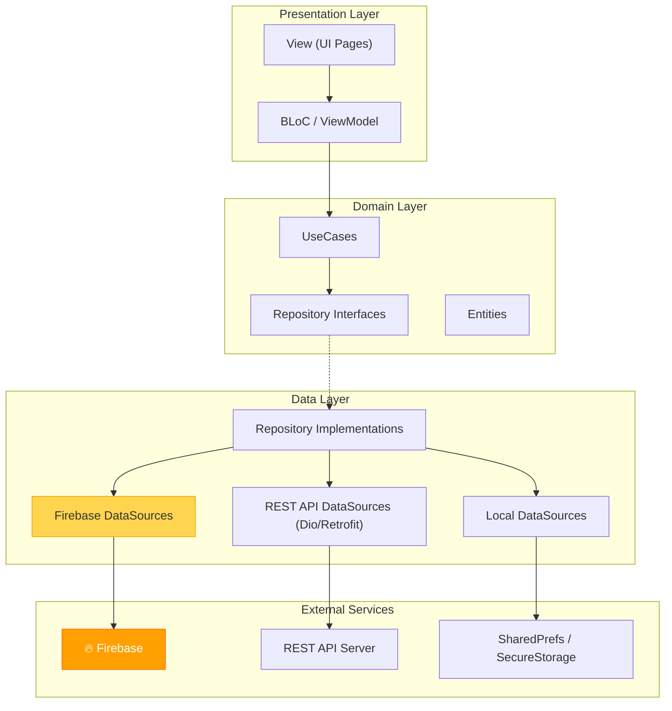

# 🔥 Hướng dẫn tích hợp Firebase vào Family Health App

> [!IMPORTANT]
> Hướng dẫn này dựa trên cấu trúc hiện tại của dự án `family_health` (Clean Architecture + MVVM, Kotlin DSL Gradle, `get_it`/`injectable`).

---

## Tổng quan các bước

| Bước | Nội dung | Thời gian ước tính |
|------|----------|-------------------|
| 1 | Tạo Firebase Project trên Console | 5-10 phút |
| 2 | Cài đặt FlutterFire CLI | 2-3 phút |
| 3 | Cấu hình Firebase cho từng platform | 5-10 phút |
| 4 | Thêm packages vào `pubspec.yaml` | 2 phút |
| 5 | Khởi tạo Firebase trong `main.dart` | 5 phút |
| 6 | Tích hợp vào Clean Architecture | 10-15 phút |
| 7 | Xác minh hoạt động | 5 phút |

---

## Bước 1: Tạo Firebase Project trên Console

1. Truy cập [Firebase Console](https://console.firebase.google.com/)
2. Click **"Add project"** → đặt tên project (ví dụ: `family-health`)
3. Bật/tắt Google Analytics tùy nhu cầu
4. Chọn account Analytics (nếu bật) → **"Create project"**

---

## Bước 2: Cài đặt FlutterFire CLI

> [!TIP]
> FlutterFire CLI tự động tạo file cấu hình cho tất cả platforms, tiết kiệm thao tác thủ công.

```powershell
# Cài đặt Firebase CLI (nếu chưa có)
npm install -g firebase-tools

# Đăng nhập Firebase
firebase login

# Cài đặt FlutterFire CLI
dart pub global activate flutterfire_cli
```

---

## Bước 3: Cấu hình Firebase cho từng platform

### 3.1. Chạy FlutterFire configure

```powershell
cd d:\VisualStudioCode\flutter_clean_architecture

flutterfire configure --project=<your-firebase-project-id>
```

Lệnh này sẽ:
- ✅ Tạo file `lib/firebase_options.dart` (auto-generated)
- ✅ Tạo `android/app/google-services.json`
- ✅ Tạo `ios/Runner/GoogleService-Info.plist`
- ✅ Tự động cập nhật Gradle files cho Android

### 3.2. Cấu hình Android (Kotlin DSL)

> [!WARNING]
> Dự án đang dùng **Kotlin DSL** (`build.gradle.kts`), nên cú pháp khác so với Groovy DSL thông thường. FlutterFire CLI có thể không tự động cập nhật được file `.kts`. Nếu vậy, cần config thủ công.

**File `android/settings.gradle.kts`** — Thêm plugin Google Services:

```diff
 plugins {
     id("dev.flutter.flutter-plugin-loader") version "1.0.0"
     id("com.android.application") version "8.9.3" apply false
     id("org.jetbrains.kotlin.android") version "1.8.22" apply false
+    id("com.google.gms.google-services") version "4.4.2" apply false
 }
```

**File `android/app/build.gradle.kts`** — Apply plugin:

```diff
 plugins {
     id("com.android.application")
     id("kotlin-android")
     id("dev.flutter.flutter-gradle-plugin")
+    id("com.google.gms.google-services")
 }
```

**Xác nhận**: File `android/app/google-services.json` đã được tạo bởi FlutterFire CLI.

### 3.3. Cấu hình iOS

FlutterFire CLI tự động thêm `GoogleService-Info.plist` vào `ios/Runner/`.

**Xác nhận thủ công trong Xcode** (nếu cần):
1. Mở `ios/Runner.xcworkspace` trong Xcode
2. Kiểm tra `GoogleService-Info.plist` đã nằm trong Runner target
3. Đảm bảo `ios/Podfile` có `platform :ios, '13.0'` trở lên

```diff
-# platform :ios, '12.0'
+platform :ios, '13.0'
```

### 3.4. Cấu hình Windows (nếu cần)

Firebase cho Windows (desktop) hiện hỗ trợ giới hạn. Nếu cần:

```powershell
flutterfire configure --platforms=windows
```

---

## Bước 4: Thêm packages vào `pubspec.yaml`

### 4.1. Core Firebase

```yaml
dependencies:
  # Firebase
  firebase_core: ^3.12.1
```

### 4.2. Packages tùy theo tính năng cần dùng

Dựa trên tài liệu SRS của ứng dụng y tế gia đình, các Firebase packages liên quan:

| Tính năng | Package | Mô tả |
|-----------|---------|-------|
| **Authentication** | `firebase_auth: ^5.5.1` | Đăng nhập/đăng ký |
| **Cloud Firestore** | `cloud_firestore: ^5.6.7` | Lưu trữ dữ liệu (hồ sơ y tế, chỉ số sức khỏe) |
| **Cloud Storage** | `firebase_storage: ^12.4.4` | Lưu ảnh, file đính kèm |
| **Cloud Messaging** | `firebase_messaging: ^15.2.4` | Push notifications (lịch khám, nhắc thuốc) |
| **Analytics** | `firebase_analytics: ^11.5.0` | Theo dõi hành vi người dùng |
| **Crashlytics** | `firebase_crashlytics: ^4.3.3` | Theo dõi lỗi production |

> [!NOTE]
> Chỉ thêm packages bạn thực sự cần. Bắt đầu với `firebase_core`, sau đó thêm dần.

### 4.3. Cài đặt

```powershell
flutter pub add firebase_core
# Thêm packages cần thiết khác, ví dụ:
# flutter pub add firebase_auth
# flutter pub add cloud_firestore

flutter pub get
```

---

## Bước 5: Khởi tạo Firebase trong `main.dart`

Cập nhật file [main.dart](file:///d:/VisualStudioCode/flutter_clean_architecture/lib/main.dart):

```diff
 import 'dart:async';

+import 'package:firebase_core/firebase_core.dart';
 import 'package:easy_localization/easy_localization.dart';
 import 'package:easy_logger/easy_logger.dart';
 import 'package:flutter/material.dart';
 import 'package:flutter/services.dart';
 import 'package:flutter_bloc/flutter_bloc.dart';
 import 'package:family_health/presentation/router/router.dart';
 import 'package:family_health/shared/utils/bloc_observer.dart';
 import 'package:family_health/shared/utils/logger.dart';
+import 'package:family_health/firebase_options.dart';

 import 'app.dart';
 import 'di/di.dart';

 Future main() async {
   runZonedGuarded(() async {
     WidgetsFlutterBinding.ensureInitialized();
+
+    // Initialize Firebase
+    await Firebase.initializeApp(
+      options: DefaultFirebaseOptions.currentPlatform,
+    );
+
     Bloc.observer = AppBlocObserver();
     // ... rest unchanged
```

> [!IMPORTANT]
> `Firebase.initializeApp()` **PHẢI** được gọi **SAU** `WidgetsFlutterBinding.ensureInitialized()` và **TRƯỚC** khi sử dụng bất kỳ Firebase service nào khác.

---

## Bước 6: Tích hợp vào Clean Architecture

Để tuân thủ kiến trúc Clean Architecture + MVVM hiện tại của dự án:

### 6.1. Data Layer — Firebase Data Sources

Tạo data sources cho từng Firebase service:

```
lib/data/remote/datasources/
├── firebase_auth_datasource.dart      # [NEW] Auth operations
├── firebase_firestore_datasource.dart # [NEW] Firestore CRUD
└── firebase_storage_datasource.dart   # [NEW] File upload/download
```

**Ví dụ `firebase_auth_datasource.dart`:**

```dart
import 'package:firebase_auth/firebase_auth.dart' as firebase_auth;
import 'package:injectable/injectable.dart';

@lazySingleton
class FirebaseAuthDataSource {
  final firebase_auth.FirebaseAuth _firebaseAuth;

  FirebaseAuthDataSource(this._firebaseAuth);

  Future<firebase_auth.UserCredential> signInWithEmail({
    required String email,
    required String password,
  }) async {
    return _firebaseAuth.signInWithEmailAndPassword(
      email: email,
      password: password,
    );
  }

  Future<void> signOut() async {
    await _firebaseAuth.signOut();
  }

  firebase_auth.User? get currentUser => _firebaseAuth.currentUser;

  Stream<firebase_auth.User?> get authStateChanges =>
      _firebaseAuth.authStateChanges();
}
```

### 6.2. DI — Đăng ký Firebase instances

Tạo module DI cho Firebase trong [di/](file:///d:/VisualStudioCode/flutter_clean_architecture/lib/di/):

```dart
// lib/di/firebase_module.dart [NEW]
import 'package:firebase_auth/firebase_auth.dart';
import 'package:cloud_firestore/cloud_firestore.dart';
import 'package:firebase_storage/firebase_storage.dart';
import 'package:injectable/injectable.dart';

@module
abstract class FirebaseModule {
  @lazySingleton
  FirebaseAuth get firebaseAuth => FirebaseAuth.instance;

  @lazySingleton
  FirebaseFirestore get firebaseFirestore => FirebaseFirestore.instance;

  @lazySingleton
  FirebaseStorage get firebaseStorage => FirebaseStorage.instance;
}
```

Sau đó chạy `build_runner` để regenerate DI:

```powershell
flutter pub run build_runner build --delete-conflicting-outputs
```

### 6.3. Domain Layer — Repository Interfaces

```dart
// lib/domain/repositories/auth_repository.dart [NEW]
abstract class AuthRepository {
  Future<void> signInWithEmail({
    required String email,
    required String password,
  });
  Future<void> signOut();
  Stream<bool> get isAuthenticated;
}
```

### 6.4. Data Layer — Repository Implementations

```dart
// lib/data/repositories/auth_repository_impl.dart [NEW]
import 'package:injectable/injectable.dart';
import 'package:family_health/data/remote/datasources/firebase_auth_datasource.dart';
import 'package:family_health/domain/repositories/auth_repository.dart';

@LazySingleton(as: AuthRepository)
class AuthRepositoryImpl implements AuthRepository {
  final FirebaseAuthDataSource _authDataSource;

  AuthRepositoryImpl(this._authDataSource);

  @override
  Future<void> signInWithEmail({
    required String email,
    required String password,
  }) async {
    await _authDataSource.signInWithEmail(
      email: email,
      password: password,
    );
  }

  @override
  Future<void> signOut() async {
    await _authDataSource.signOut();
  }

  @override
  Stream<bool> get isAuthenticated =>
      _authDataSource.authStateChanges.map((user) => user != null);
}
```

### 6.5. Sơ đồ kiến trúc



---

## Bước 7: Xác minh hoạt động

### 7.1. Kiểm tra cấu hình cơ bản

```powershell
# Build thử Android
flutter build apk --debug

# Build thử iOS (trên macOS)
flutter build ios --debug --no-codesign
```

### 7.2. Kiểm tra Firebase khởi tạo thành công

Thêm log tạm vào `main.dart` để verify:

```dart
await Firebase.initializeApp(
  options: DefaultFirebaseOptions.currentPlatform,
);
logger.i('Firebase initialized: ${Firebase.app().name}');
```

Nếu thấy log `Firebase initialized: [DEFAULT]` → ✅ thành công.

### 7.3. Kiểm tra trên Firebase Console

- Vào Firebase Console → Project → Xem **"1 app connected"** cho mỗi platform đã cấu hình

---

## ⚠️ Lưu ý quan trọng

1. **Bảo mật**: Thêm `google-services.json` và `GoogleService-Info.plist` vào `.gitignore` nếu là dự án open source
2. **minSdk**: Firebase yêu cầu `minSdk >= 21` (hiện tại dự án dùng `24` → ✅ OK)
3. **iOS version**: Firebase yêu cầu iOS 13.0+ — cần uncomment và cập nhật trong `Podfile`
4. **Kotlin version**: Một số Firebase packages yêu cầu Kotlin 1.9+, kiểm tra nếu gặp lỗi build
5. **Windows**: Firebase hỗ trợ desktop (Windows) giới hạn — chỉ có `firebase_core`, `firebase_auth`, `cloud_firestore`, `firebase_storage`

---

## Checklist tóm tắt

- [ ] Tạo Firebase project trên Console
- [ ] Cài `firebase-tools` và `flutterfire_cli`
- [ ] Chạy `flutterfire configure`
- [ ] Cập nhật `settings.gradle.kts` (thêm Google Services plugin)
- [ ] Cập nhật `android/app/build.gradle.kts` (apply plugin)
- [ ] Xác nhận `google-services.json` tồn tại
- [ ] Xác nhận `GoogleService-Info.plist` tồn tại
- [ ] Cập nhật `ios/Podfile` (platform iOS 13.0+)
- [ ] Thêm `firebase_core` vào `pubspec.yaml`
- [ ] Chạy `flutter pub get`
- [ ] Cập nhật `main.dart` (khởi tạo Firebase)
- [ ] Tạo `lib/di/firebase_module.dart` (DI module)
- [ ] Chạy `build_runner`
- [ ] Build thử và xác nhận Firebase khởi tạo thành công
